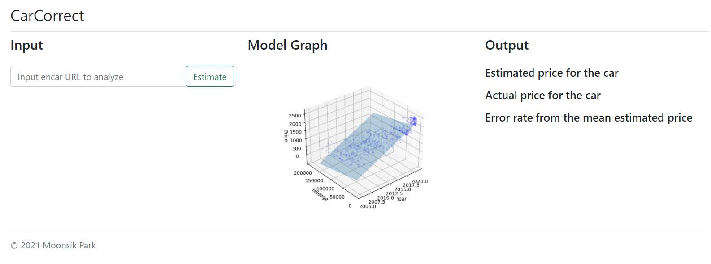
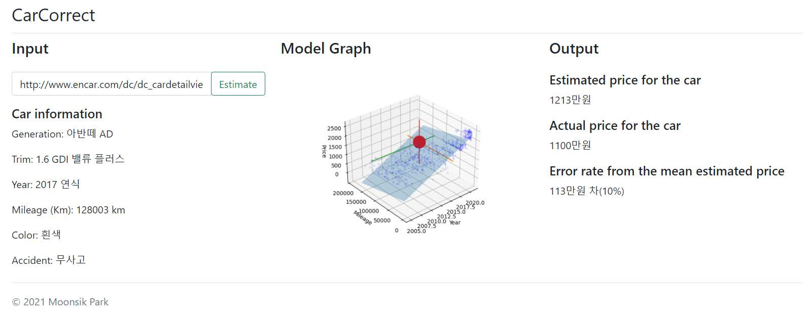

# Used Car Price Predictor

## Introduction
This repository contains the code of the project that I created during Fall 2021 "Data Mining" class by Prof. Sanguk Noh at the Catholic University of Korea.

The project has aimed to estimate used car prices in used car sales website [Encar](http://www.encar.com/) using Linear Regression algorithm. We were able to estimate used car prices with least RMSE of 81.6 (20% random selection of training examples, 10-fold cross validation, normalized by count of model).

We have devised a frontend which accepts an Encar URL, and shows the actual and estimated price of the inputted car.

## Screenshot

## Used libraries
| Usage | Library Name |
| --- | --- |
| Backend Language  | Python 3.10.1 |
| Backend Crawling Framework | requests 2.27.1 |
| Backend Machine Learning Library | scikit-learn 1.0.2 |
| Backend Server Framework | Flask 2.0.2 |
| Backend Graph Visualization Framework | matplotlib 3.5.0 (with mplot3d) |
| Frontend Language | HTML, CSS, JavaScript(jQuery) |

## Report
The report of this project can be found at: [DataMiningProjectReport.pdf](report/DataMiningProjectReport.pdf) (In Korean)
